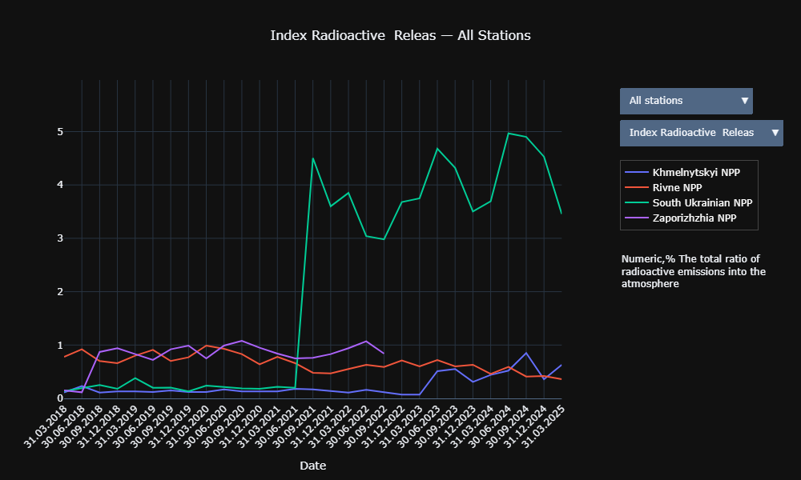
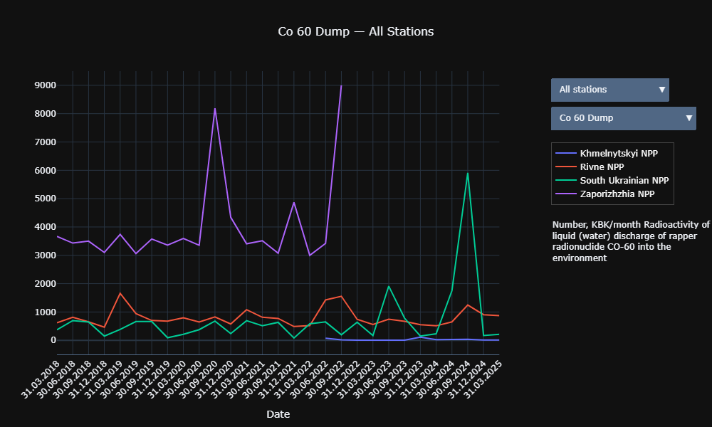

# 📊 Ukrainian NPPs: Open Data Analysis


## Table of Contents

- [About](#about)
- [Examples](#examples)
- [Goal](#-goal)
- [Why This Project Matters](#-why-this-project-matters)
- [Technologies | Stack](#-technologies--stack)  
- [Data Source](#-data-source)
- [Key Features](#-key-features)
- [Use Case](#-use-case)
- [Quickstart](#-quickstart)
- [Run the notebook](#-run-the-notebook)
- [Envirement](#envirement)
- [Docker](#-docker)
- [Project Structure](#-project-structure)
- [Testing](#-testing)
- [License & Data Usage](#️-license--data-usage)
- [What I Learned / Built Here](#-what-i-learned--built-here)
- [Author](#-author)
- [Development Plans](#️-development-plans)

## About

This project explores open datasets on radioactive emissions and discharges from  
nuclear power plants (NPPs) in Ukraine. Using Python, Pandas, and Plotly, we  
analyze environmental indicators across several stations and visualize quarterly  
changes over time.  
All data is retrieved from publicly available government sources.

## Examples




## 🎯 Goal  

Better understand trends in emission levels and present the data in an  
accessible, interactive format.  

## 💡 Why This Project Matters

Ukraine's energy sector, especially nuclear energy, is vital and sensitive.  
However, public data on its status is often fragmented or not easily accessible.

This project makes Ukrainian NPP (Nuclear Power Plant) data:

- 📂 **Accessible** — parsed and structured from open government sources
- 🔍 **Usable** — cleaned and pre-processed for analysis
- 🔁 **Reusable** — exposes data for other developers, analysts, or watchdogs

By offering an interface (API and visuals in the future), this tool can help:

- Analysts monitor energy safety and trends
- NGOs use this data for transparency reports
- Developers integrate it into educational or civic tech tools

## 🧪 Technologies | Stack

- **Backend**: Python, Request  
- **Data Analysis**: Pandas, Plotly  
- **Development Tools**: Poetry, Ruff, Black  
- **Testing**: Unittest, Pytest  
- **Notebooks**: Jupyter Notebook  

## 📂 Data Source

- [Open data portal][1]

- [Ecological and radiation situation in the area of ​​nuclear power plants][2]

- [How to retrieve a dataset (API)?][3]

[1]: https://data.gov.ua/en/

[2]: https://data.gov.ua/en/dataset/4a9d3d56-bd95-4c3e-97e7-1cdc7bcbd445/resource/d55eebcf-4660-4919-96b3-4894be5a6cda

[3]: https://data.gov.ua/pages/aboutuser2#:~:text=%D0%AF%D0%BA%C2%A0%D0%B7%D0%B0%D0%B1%D1%80%D0%B0%D1%82%D0%B8%20%D0%BD%D0%B0%D0%B1%D1%96%D1%80%20%D0%B4%D0%B0%D0%BD%D0%B8%D1%85%20(API)%3F

## 🔍 Key Features

- Fetch real-time datasets
- Process Excel reports into structured DataFrames
- Build interactive, filterable visualizations (Plotly)
- Analyze radioactive emissions, discharges, and thresholds
- Modular structure and reusable components

## 📈 Use Case

This project allows researchers and developers to explore environmental metrics  
such as:

- Inert radioactive gas emissions (IRG)
- Iodine radionuclides index
- Long-living isotopes
- Cs-137 and Co-60 emissions/discharges
- Quarterly and annual release indexes

## 🚀 Quickstart

Follow these steps to set up and run the project:

### Prerequisites  

- Python 3.12+

### Steps  

1. Clone the repository:

    ```powershell
    git clone https://github.com/Asbuga/Ukrainian-NPPs.git
    cd Ukrainian-NPPs
    ```

2. Create and activate your environment with pip:

    ```powershell
    python -m venv .venv
    .\.venv\Scripts\activate
    ```

3. Install dependencies in virtual environment:

    ```powershell
    pip install -r requirements.txt
    ```

Now you're ready to explore the project!

## 📓 Run the notebook

To analyze data or visualize results, you can use Jupyter Notebook. Follow these  
steps:

Run Jupyter Notebook:  

```bash
jupyter notebook
```

Now you can explore and analyze the data interactively!

## 🧠 Project Structure

```bash

```

## 🧪 Testing

To ensure the project is working correctly, you can run the test suite. Follow  
these steps:

1. Activate the virtual [environment](#-quickstart).

2. Run the tests using pytest:

    ```bash
    poetry run pytest
    ```

    For a more detailed output, use the verbose mode:

    ```bash
    poetry run pytest -v
    ```

This will execute all unit and integration tests and provide a summary of the  
results.

## ⚠️ License & Data Usage

All datasets are sourced from data.gov.ua and distributed under the Creative  
Commons Attribution 4.0 License (CC BY 4.0).  
Make sure to attribute the original source if you reuse the data.  

### 👨‍💻 My Role

This project was created as a part of my learning path and personal interest in  
open data and energy infrastructure in Ukraine.  
My main responsibilities and skills demonstrated here include:

- 🔧 Backend Development: Data parsing, cleaning, transformation using Python  
& Pandas
- 🔌 API Design (in progress): RESTful endpoints for accessing processed data
- 📊 Data Analysis: Exploratory data analysis of NPP metrics, preparing it for  
visualization
- 🧱 Project Structure: Organizing code for clarity, scalability, and future  
API integration

## 📚 What I Learned / Built Here

- Processing open government data: collection, cleaning, transformation
- Working with tabular sources (CSV, XLSX) using Pandas
- Developing a basic architecture for a REST API (FastAPI, in development)
- Building graphs/visualizations using Plotly
- Organizing the project structure for scaling

## 👨‍💻 Author

**Andrii Buha**  
Python Backend Developer | Django & FastAPI | Data Processing  

If you're interested in collaboration, feedback, or hiring — feel free to  
reach out:

📬 [LinkedIn](https://www.linkedin.com/in/andrii-buha/)  
💻 [GitHub](https://github.com/Asbuga)  

## 🛠️ Development plans  

- [ ] REST API
- [ ] Tests  
- [ ] Deploy  
